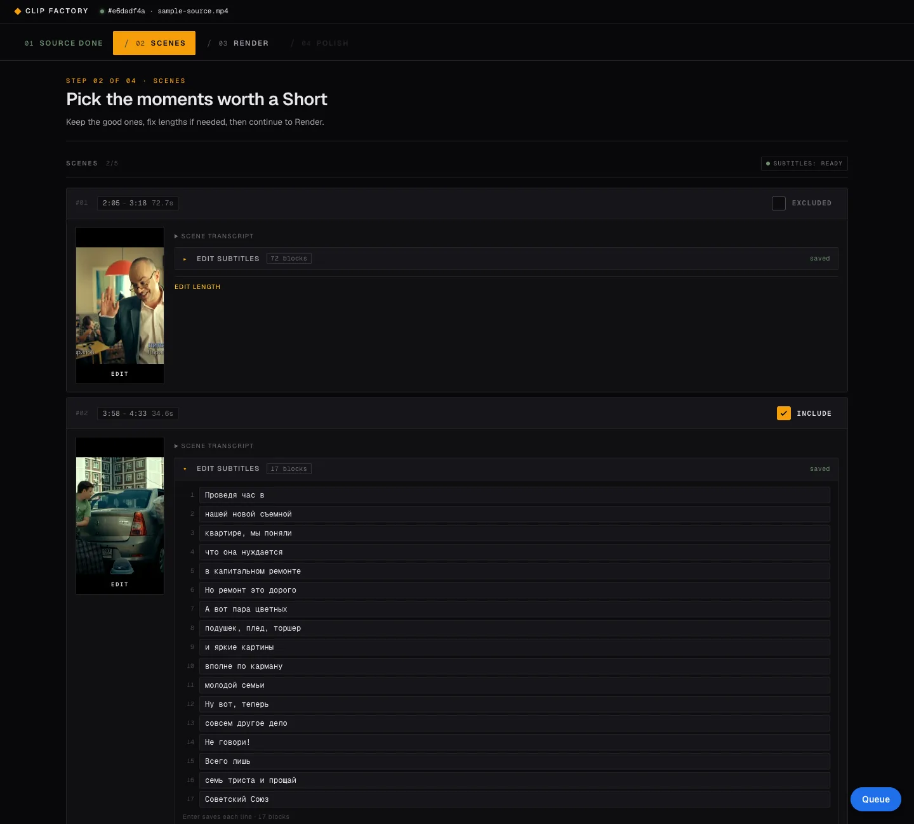
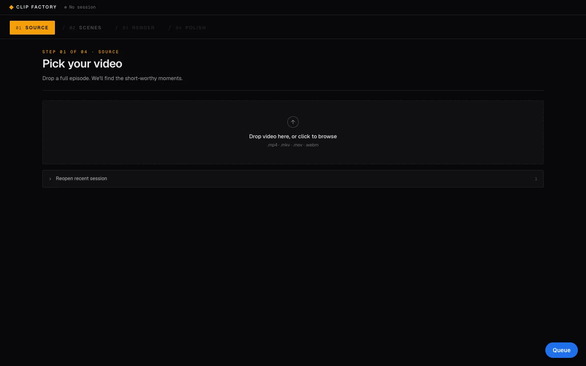
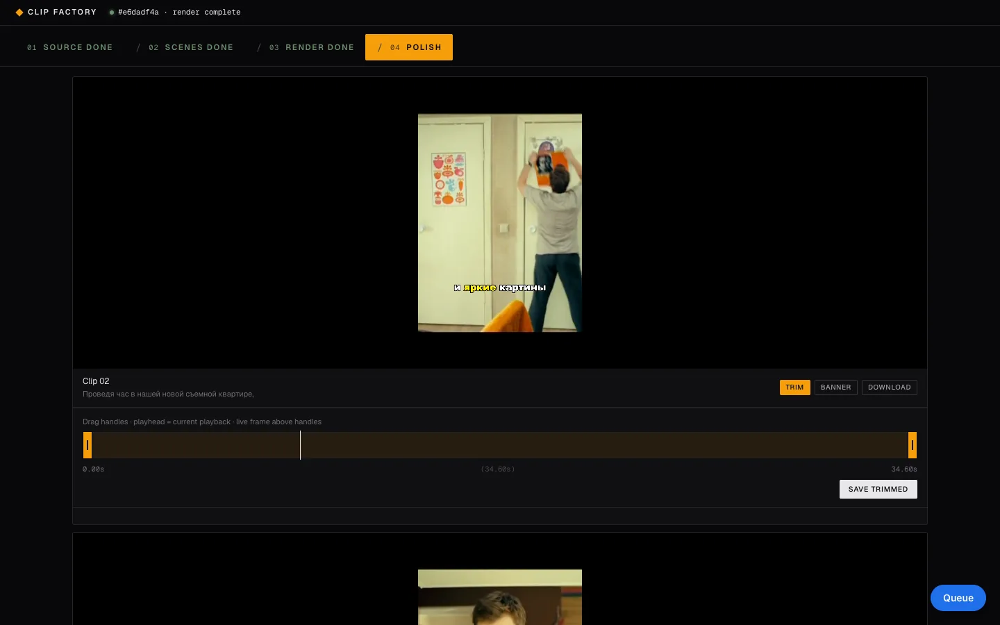

# Clip Factory

An LLM pipeline that cuts a long episode into 9:16 clips with burned-in subtitles.

It takes a full episode of a Russian TV series, picks the moments that work as Shorts, and renders them as 1080x1920 clips with word-timed subtitles. Tested on 10 episodes of one sitcom. It is built for one operator who runs a clip channel and wants to review the AI's picks, fix timings and subtitles, and export, instead of cutting by hand in an editor.



**Live demo:** [factory.prfo.design](https://factory.prfo.design). It runs with `DEMO_MODE=1` and one sample session. Upload, punctuation, scene and subtitle edits, render, trim and banner return 403 there. Browsing the sample session and style previews work. Run it locally for the full pipeline.

## Key technical decisions

### Pipeline stages

| # | Stage | Model | What it does |
|---|---|---|---|
| 1 | Transcribe | `whisper-1` | FFmpeg extracts 16 kHz mono 32 kbps MP3 (about 5.5 MB for 23 min, so the 25 MB API limit allows about 100 min). Returns segments and word timestamps. |
| 2 | Typo check | `gpt-4o-mini` | Reads the full transcript (about 4,500 tokens), returns `{wrong, right, context}` fixes. Whole-word regex replace; timestamps untouched. |
| 3 | Scene picking | `gpt-4o`, streamed | Timestamped transcript with a pause marker for every gap over 1.5 s (about 10,000 tokens). Asks for 5-7 scenes of 45-90 s. |
| 4 | Operator review | - | Include or exclude, drag scene edges, add a scene by hand. |
| 5 | Punctuation | `gpt-4o-mini`, per scene | Returns subtitle lines of 2-4 words. One scene at a time (50-150 words), because rules held worse on a 5,000-word episode. |
| 6 | Cinema layout | `gpt-4o`, per scene | Only for the default "cinema" preset. Asks for frames of at most 2 lines, 23 non-space characters per line, 46 per frame. Code re-checks timing and overlaps, not line length. |
| 7 | Render | FFmpeg + libass | ASS subtitles, crop or letterbox to 9:16, libx264 CRF 23, AAC 128k. |

### Cost per episode

Measured on 10 cached sessions of the same series (21-24 min each). Input tokens are counted with the `o200k_base` tokenizer on the exact prompts the code builds; output tokens for stages 5 and 6 are estimated from scene word counts. Prices are OpenAI list prices: `whisper-1` $0.006 per minute, `gpt-4o` $2.50 / $10 per 1M tokens in / out, `gpt-4o-mini` $0.15 / $0.60.

| Stage | Model | Median, 23 min episode |
|---|---|---|
| Transcription | whisper-1 | $0.138 |
| Typo check | gpt-4o-mini | $0.001 |
| Scene picking | gpt-4o | $0.033 |
| Punctuation, 5 scenes | gpt-4o-mini | $0.002 |
| Cinema layout, 5 scenes | gpt-4o | $0.090 |
| **Total** | | **$0.27** (range $0.23-0.34) |

Transcription scales with length and dominates. A 45 min episode comes to about $0.44, or about $0.34 with a non-cinema preset.

### Content-hash cache

The upload is hashed with SHA-1 while it streams to disk in 1 MB chunks. `job_id` is the first 8 hex characters, and all state lives in `output/<job_id>/` as JSON: transcript, words, corrections, scenes, subtitle groups, cinema layouts. Re-uploading the same file hits every cache, so it costs $0. Cinema layouts are cached by a hash of the scene's subtitle groups, so editing one line re-runs one scene. There is no database; a restarted server rebuilds sessions from disk.

### Word timestamp alignment

The LLMs only decide text and line breaks. Timing always comes from Whisper word timestamps:

- Punctuated lines are matched back to words by a normalized form (lowercase, letters and digits only) with a 15-word lookahead, so words the model drops on purpose (sound tags like "MUSIC") do not shift the rest.
- Cinema frames get their start and end re-derived from the words they contain, plus a 0.25 s tail. The model's own timestamps are ignored.
- In the chunks, karaoke and one word presets a line stays on screen until the next one starts if the gap is under 1.5 s, otherwise it holds for 0.8 s after the last word.
- `setpts=PTS-STARTPTS` after a fast seek keeps ASS times, which start at zero, in sync with the cut.

### Deterministic guards around LLM output

Every model call uses JSON response format and is followed by code that does not trust it:

- Scene picking clamps times to the video length and drops scenes outside 20-150 s. If fewer than 3 survive, it retries once at temperature 0.6 and keeps the better result.
- Punctuation output is split again on `.`, `?` and `!`, and trailing `.,;:` and dashes are stripped so lines end only in `!` or `?`. Any exception falls back to plain 3-word groups.
- Cinema frames are clamped so frame N ends before frame N+1 starts. If the call fails or no key is set, a local heuristic builds the frames. A render never fails because of a model.

### Live progress over SSE

`GET /api/progress/{job_id}` streams pipeline events from an in-memory list, polled every 0.3 s: step changes, the scene picker's JSON token by token, typo fixes, per-scene punctuation, per-clip render progress. The stream closes on `render_done` or `error`.

### Render queue

`GET /api/queue` collects every approved scene without a rendered clip across all sessions. Each item can be rendered alone with its own preset. If the operator moved the scene edges in the queue, the new timecodes are saved first and that scene's subtitles are regenerated, then the clip is cut.

### Style preview and post-processing

- Four presets: cinema (up to 2 lines), chunks (one line per frame), karaoke (active word in yellow), one word (130 pt).
- Preview: 5 s from the middle of the scene at 480x854, no audio, `ultrafast` preset.
- Full render: two clips of 35 s and 27 s took about 19 s on an Apple Silicon Mac.
- Trim with two handles and a live frame preview; banner overlay (PNG, GIF or video) at 7 preset positions or a free position, with an optional frozen first-frame intro.

### DEMO_MODE and deploy

`DEMO_MODE=1` returns HTTP 403 for upload, punctuation, scene and subtitle edits and queue rendering. It never calls OpenAI: the cinema preset uses the local heuristic unless a cached layout exists. It runs without a key. The public demo runs uvicorn behind nginx in this mode with one seeded session; nginx serves the pre-extracted scene thumbnails from disk. `start-demo.sh` is the fallback: local uvicorn plus a Cloudflare Quick Tunnel that prints a public URL. It starts in DEMO_MODE unless DEMO_MODE=0 is set.

## Screens





The footage in the screenshots is a third-party TV series used as test input.

## Stack

- Python 3.10+, FastAPI, uvicorn, python-multipart
- OpenAI API: whisper-1, gpt-4o, gpt-4o-mini
- FFmpeg with libass for rendering, ffprobe for sizing
- Frontend: one HTML file, vanilla JS and CSS, no build step
- Storage: JSON files per session, no database
- Publishing: Telegram Bot API via `requests`

## Run locally

Requires Python 3.10+ and FFmpeg built with libass.

```bash
# FFmpeg with libass
brew install ffmpeg                 # macOS
sudo apt install ffmpeg             # Debian / Ubuntu
ffmpeg -hide_banner -filters | grep -w ass   # must print the "ass" filter

git clone https://github.com/shorokhlev-sketch/clip-factory.git
cd clip-factory
python3 -m venv .venv
. .venv/bin/activate
pip install -r requirements.txt

# OpenAI key: environment variable or a file
export OPENAI_API_KEY=sk-...
# or
mkdir -p ~/.config/clip-factory && echo "sk-..." > ~/.config/clip-factory/key && chmod 600 ~/.config/clip-factory/key

python -m uvicorn app:app --port 8765
# open http://127.0.0.1:8765 and drop a video file
```

The server starts without a key. It reads the key when you upload a file or open a session. The `echo` line overwrites an existing key file.

Run the server from the repo root: `output/` and `static/` are resolved relative to the working directory. Sessions live in `output/`, which is not in the repo, so a fresh clone starts empty. The first upload of a 23 min episode costs about $0.27. `DEMO_MODE=1` runs without a key but blocks upload, so it only helps where sessions already exist. To browse a sample session without a key, open the live demo at [factory.prfo.design](https://factory.prfo.design).

Publishing to Telegram. `~/.config/clip-factory/publish.json` holds bot tokens and chat ids:

```json
{
  "telegram_api_base": "https://api.telegram.org",
  "channels": {
    "clips_ru": {
      "niche": "short clips",
      "telegram": {"bot_token": "123456:ABC...", "chat_id": "@my_channel"}
    }
  }
}
```

```bash
python publish.py list
python publish.py post --job <job_id> --channel <name> --dry-run
```

## Status

Works:

- Full pipeline from upload to rendered clips, with review and editing at every step
- Four subtitle presets with live 5 s previews
- Per-scene subtitle editing, scene edge editing, manual scenes
- Cross-session render queue
- Trim, banner overlay, frozen intro
- Telegram publishing with a per-clip post log (`posted.json`), so nothing is posted twice

Known limits:

- Russian only: `language='ru'` is hard-coded and prompts are in Russian.
- The scene picker sometimes merges several moments into one long scene. The 150 s cap and one retry catch most cases, not all.
- 16:9 sources are center-cropped, so action at the frame edges is lost. Letterboxed sources keep their black bands.
- Punctuation reads 4 s of speech before the scene start for context. The last line from that window can show at the very start of a clip until the first in-scene line.
- Job state is in memory in one process, with no auth and no job isolation. It is a single-operator tool, not a multi-user service.
- YouTube and VK publishers are stubs.
- No automated tests.

## License

MIT, see [LICENSE](LICENSE).
